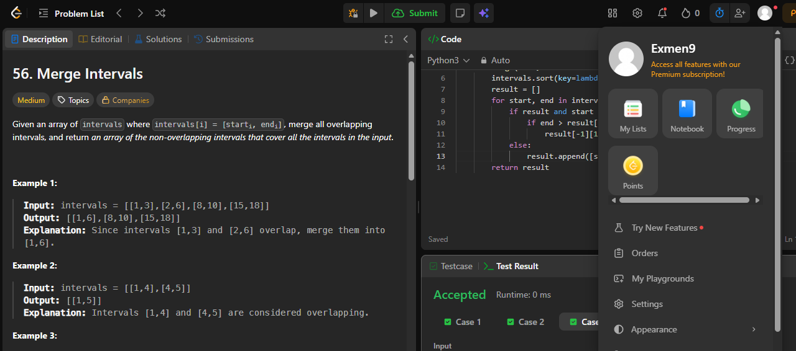
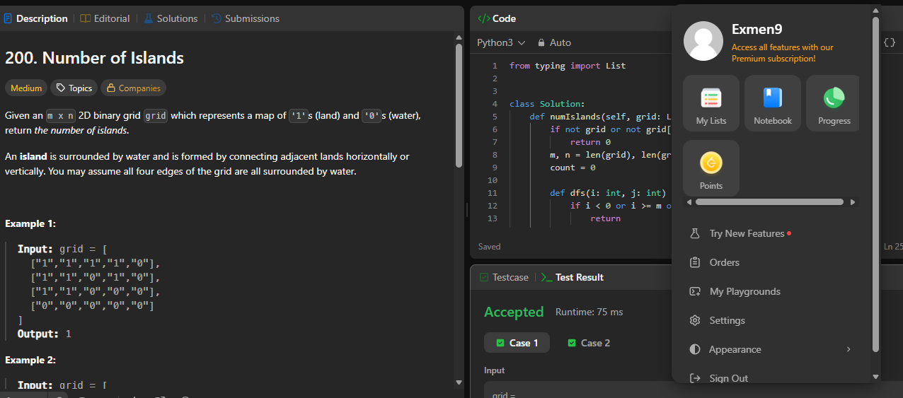
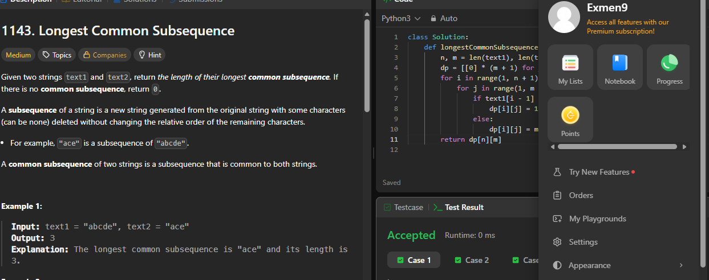
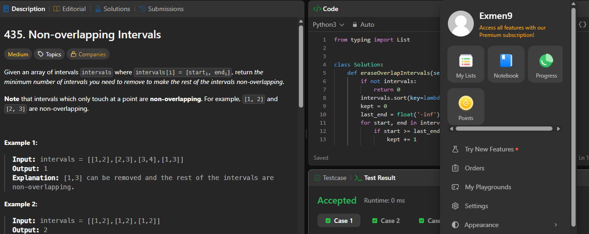
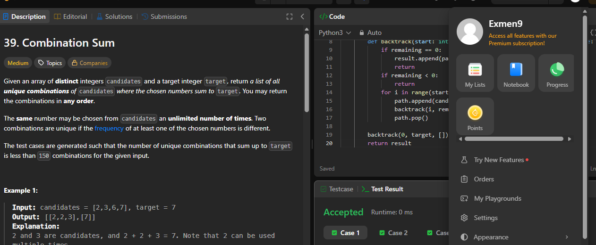

# Taller · Cinco familias en LeetCode

**Curso:** Análisis de algoritmos · ITM · 2026-2
**Autor:** Sebastian Cadavid Monsalve — @Exmen9 (usuario leetcode)

Cada ejercicio incluye enlace, familia, idea y complejidad. Las capturas de Accepted están en `evidencias/`.

---

## 56. Merge Intervals
- Enlace: https://leetcode.com/problems/merge-intervals/
- Familia: **Ordenamiento**
- Idea: ordenar por `start`; fusionar el intervalo abierto con el siguiente si `start <= end_actual`.
- Complejidad: `O(n log n)` tiempo, `O(n)` espacio.

---

## 200. Number of Islands
- Enlace: https://leetcode.com/problems/number-of-islands/
- Familia: **Grafos** (componentes conexas en grilla implícita).
- Idea: cada `'1'` no visitado lanza un DFS que hunde su isla; contar cuántos DFS.
- Complejidad: `Θ(m·n)` tiempo, `O(m·n)` espacio.

---

## 1143. Longest Common Subsequence
- Enlace: https://leetcode.com/problems/longest-common-subsequence/
- Familia: **Programación dinámica**
- Estado: `dp[i][j]` = LCS de prefijos. Recurrencia: `1+dp[i-1][j-1]` si coinciden, si no `max(dp[i-1][j], dp[i][j-1])`.
- Complejidad: `Θ(n·m)` tiempo, `Θ(n·m)` espacio.

---

## 435. Non-overlapping Intervals
- Enlace: https://leetcode.com/problems/non-overlapping-intervals/
- Familia: **Greedy**
- Criterio: ordenar por `end`, elegir el que termina antes y no solapa. Respuesta = `n − retenidos`.
- Complejidad: `O(n log n)` tiempo, `O(1)` extra.

---

## 39. Combination Sum
- Enlace: https://leetcode.com/problems/combination-sum/
- Familia: **Backtracking**
- Elige: `candidates[i]`. Deshace: `path.pop()`. Reutiliza el mismo `i`. Poda si `remaining < 0`.
- Complejidad: exponencial; espacio = profundidad + salida.

